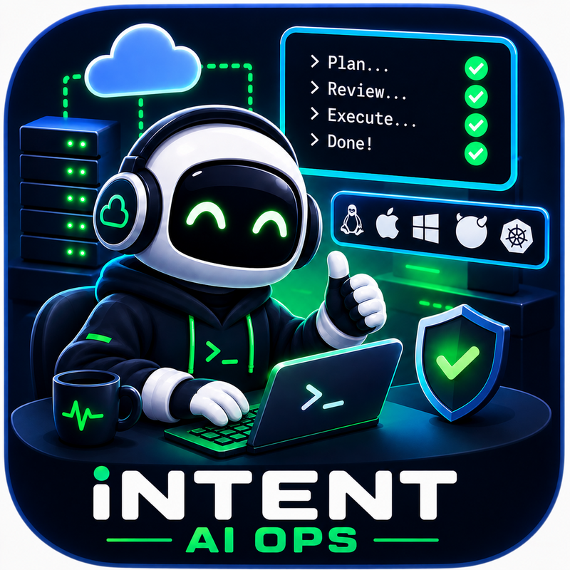
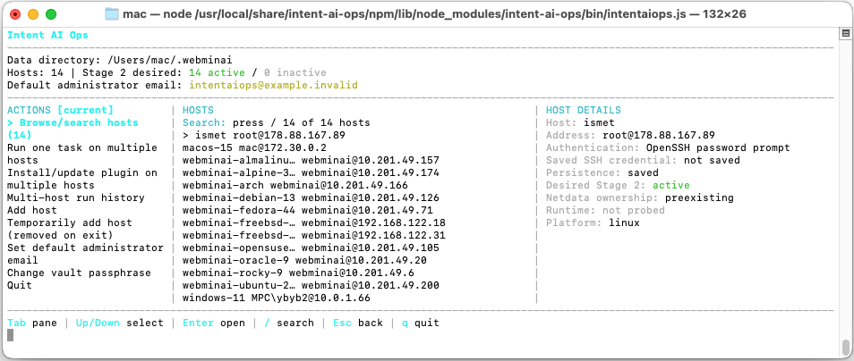

# Intent AI Ops

<p align="center">
  <a href="https://intentaiops.top">
    
  </a>
</p>

<p align="center">
  Manage one or many hosts like a system administrator or DevOps engineer, using natural-language instructions.
</p>
<p align="center">
  <a href="https://www.youtube.com/watch?v=i01pbFc0i7A">
    Watch the Intent AI Ops usage example on YouTube
  </a>
</p>
<p align="center">
  
</p>

**Intent AI Ops** is an interactive CLI for administering servers with natural-language tasks. It connects through your system OpenSSH client, asks a local Codex CLI to prepare a structured plan, lets you review that plan, and executes only approved commands through Intent AI Ops's signed Netdata plugin.

No separate AI agent is installed on each controlled host. Detailed technical and agent-facing documentation lives in [AI_AGENT_REFERENCE.md](AI_AGENT_REFERENCE.md).

## What Intent AI Ops can do

- Manage Linux, FreeBSD, macOS, Windows, and Kubernetes targets from one terminal.
- Plan and run administration tasks on one host or several hosts in parallel.
- Inspect platform, monitoring, Docker/Podman, privilege, Netdata, and Stage 2 health.
- Install verified common software using platform-aware, reversible plans.
- Use Netdata for monitoring and inventory, and optionally connect an existing Agent to Netdata Cloud.
- Save task plans, progress, results, retries, and rollback plans in per-host SQLite history.
- Retry a failed task with its earlier evidence, or run its saved revert plan.
- Open a real interactive system SSH shell when manual work is needed.

Multi-host tasks occupy some of the same territory as Ansible or Salt: one operation can target many machines and each host keeps an independent result. Intent AI Ops is not a replacement for declarative configuration management, but its initial learning curve is lower for ad-hoc work—you can describe the desired outcome in ordinary language instead of first writing a playbook or state tree. Commands are still shown before execution.

## Current verified common tasks

Application routes currently in the catalog:

| Application | Linux without Docker | Linux Docker Compose | FreeBSD | Windows Docker | macOS Colima | Kubernetes |
| --- | --- | --- | --- | --- | --- | --- |
| WordPress | Yes | Yes | Yes | Yes | Yes | Yes |
| WooCommerce | Yes | Yes | Yes | Yes | Yes | Yes |
| Joomla | Yes | Yes | Yes | Yes | Yes | Yes |
| Drupal | Yes | Yes | Yes | Yes | Yes | Yes |
| PrestaShop | Yes | Yes | Yes | Yes | Yes | Yes |
| Moodle | Yes | Yes | Yes | Yes | Yes | Yes |
| Nextcloud | No | No | Yes | No | No | No |
| Magento Open Source | No | Yes | Yes | Yes | Yes | Yes |
| n8n | Yes | Yes | Yes | Yes | Yes | Yes |
| Ghost | Ubuntu only | Yes | Yes | Yes | Yes | Yes |
| Mattermost | Debian/Ubuntu and EL9 | Yes | Yes | Yes | Yes | Yes |
| Odoo Community | Ubuntu only | Yes | Yes | Yes | Yes | Yes |
| Jellyfin | Debian/Ubuntu and supported glibc distros | Yes | Yes | Yes | Yes | Yes |
| Home Assistant | No | Yes | Yes | Yes | Yes | Yes |
| Intent AI Ops CLI | Host-native | Host-native, not Compose | Host-native | Host-native, not Docker | Host-native, not Colima | No |

Platform and maintenance tasks:

| Platform | Runtime setup | Diagnostics and maintenance | Other verified tasks |
| --- | --- | --- | --- |
| Linux | Docker Engine and Compose | Host health report; current-release updates | nginx static site; htop; jq; system user; swap file; systemd service; systemd timer; cron; logrotate; tmpfiles |
| FreeBSD | Podman Suite and Compose; FreeBSD supports 14.3+, while Intent AI Ops's bootstrap is currently validated on 15+ | Host health report; current-release updates | — |
| Windows | WSL 2 and Docker Desktop | Host health report; current-release updates | Brave Browser |
| macOS | Colima and Docker Compose | Host health report | — |
| Kubernetes | Uses the existing cluster runtime | — | nginx static website |

This is catalog support, not a promise that every task fits every machine. Intent AI Ops shows only tasks eligible for the detected OS version, distro, service manager, package sources, architecture, virtualization, container environment, and runtime policy. For example, systemd tasks require systemd, swap is hidden inside containers, and Kubernetes tasks do not install a container runtime or agent on every node.

### When Docker or Podman is preferred

The default preference is **Automatic**:

| Target | Preferred route |
| --- | --- |
| Linux server or VM | Docker Compose; Intent AI Ops offers Docker setup when needed |
| Linux container | Native installation; nested Docker stays off |
| Windows | Linux-container Docker Desktop through WSL 2 |
| macOS | Docker Compose through Colima |
| FreeBSD 14.3+ outside a jail | Podman Suite and Podman Compose; current Intent AI Ops application validation may require 15.1 |
| Kubernetes | Kubernetes API workloads; Docker/Podman preference is not used |

- **Automatic:** follows the table and uses a reviewed native route when containers are unsuitable.
- **Enabled:** explicitly requests the container route. Platform, virtualization, and jail/container safety checks still run.
- **Disabled:** uses reviewed native routes only and hides tasks that require Docker, Podman, or Colima.

Native Linux web stacks prefer nginx and PHP-FPM Unix sockets. Container credentials are generated on the host and stored in protected files, never in AI context or task history.

## Usage

Run Intent AI Ops on the administration computer. Requirements:

- System `ssh` and `scp` binaries.
- An installed and authenticated Codex CLI. A ChatGPT/Codex subscription is recommended; Intent AI Ops itself does not require a separate OpenAI API key.
- Working SSH access to each target. Stage 2 installation also needs an administrator/root account, sudo, or doas.

Install Codex using the [official Codex CLI instructions](https://learn.chatgpt.com/docs/codex/cli), run `codex`, and sign in. Then use the bootstrap installer; it provides Node.js 24 when needed:

```sh
curl -fsSL https://raw.githubusercontent.com/cryptofuture/intentaiops/main/scripts/install.sh | sh
```

On Windows PowerShell:

```powershell
irm https://raw.githubusercontent.com/cryptofuture/intentaiops/main/scripts/install.ps1 | iex
```

Kubernetes uses its own direct API flow—no SSH server or plugin on every node is needed:

1. From the main dashboard, choose **Add Kubernetes cluster** and enter a cluster name.
2. Choose **Paste kubeconfig YAML (hidden)** or **Read kubeconfig from a local path**. The kubeconfig must contain embedded CA data and either embedded client certificates or a token.
3. Intent AI Ops tests the selected context, API version, and node access before saving the kubeconfig vault-encrypted.
4. Choose **Browse Kubernetes clusters**, open the cluster, then choose **Activate/update Stage 2 gateway**.

The ordinary **Add host** action remains for SSH hosts.

If Node.js 24.7+ and npm are already installed, install the committed package:

```sh
npm install --global https://raw.githubusercontent.com/cryptofuture/intentaiops/main/dist/intent-ai-ops.tgz
```

Or install directly from the current branch:

```sh
npm install --global https://github.com/cryptofuture/intentaiops/archive/refs/heads/main.tar.gz
```

Traditional checkout:

```sh
git clone https://github.com/cryptofuture/intentaiops.git
cd intentaiops
npm i
npm link
intentaiops
```

Run the same installation again to update, then start with `intentaiops`. Data is stored in `~/.intentaiops`; an existing `~/.webminai` vault is reused automatically. Select another directory with:

```sh
intentaiops --data-root /absolute/path
```

The first run creates a vault and asks for a passphrase of at least 12 characters. Prefer five or more random words, or at least 20 password-manager-generated characters; length alone does not make a predictable password strong.

The dashboard also lets you set one global administrator email. Verified application installers use it where software requires an initial administrator or contact address—for example, the WordPress administrator account, WooCommerce store contact, or another application's setup email. Relevant AI-planned tasks receive the same preference. The value is vault encrypted and is never used as an SSH username, host identifier, or Netdata identity. If no email is configured, Intent AI Ops uses the intentionally non-deliverable `intentaiops@example.invalid` fallback.

## SSH and secret protection

- **Codex runs locally.** Intent AI Ops uses your signed-in Codex CLI directly, so it needs no separate OpenAI API key.
- **Secrets stay protected.** SSH connections and saved credentials are encrypted in a strong local vault. Saving an SSH password or key passphrase is optional and disabled by default. One-time sudo passwords are never saved.
- **AI receives no secrets.** Sensitive values are removed from inventory, diagnostics, logs, and task history before context reaches Codex. The AI never receives your vault, SSH credentials, connection strings, private keys, tokens, or generated application passwords.

Intent AI Ops uses the system OpenSSH client. Temporary hosts disappear when Intent AI Ops exits, while their task history can be safely reattached if the same machine is added again.

## Giving tasks and using history

Add a saved or temporary host by giving it a name and pasting the SSH command that already works for you, for example:

```text
ssh -p 2222 -i ~/.ssh/edge admin@edge.example.com
```

Connect to the host, activate Stage 2 or install/update only its plugin, then choose an AI-assisted or verified task.

Write tasks naturally:

```text
Install nginx and serve a health page on port 8080
```

Prefix a request with `?` to consult Codex without proposing, approving, or executing commands:

```text
? Why is host memory usage increasing, and what should I inspect first?
```

Before execution, Intent AI Ops shows the complete plan, warnings, files and paths, commands, dependencies, and saved revert commands. You can approve the whole displayed plan, review commands individually, or cancel. Approval defaults are conservative.

Task history is the per-host audit trail of requests, Codex progress, plans, command output, errors, retries, and reverts. Open **Task history and reverts**, select a task, then choose:

- **Retry with automatic corrections from history** to let Codex use the previous failure evidence.
- **Retry with additional correction instructions** to add your own guidance.
- **Run the saved revert plan** to execute the reviewed rollback commands.

Retries create new records and never overwrite the original task. Multi-host runs group separate per-host tasks, allowing failed hosts to be cleaned up and retried without rerunning successful hosts.

## Development

```sh
npm test
npm run lint
npm run typecheck
npm run test:package-install
```

Intent AI Ops's verified common tasks are learned and promoted through disposable Linux distro containers, FreeBSD VMs, Windows and macOS hosts, and Kubernetes labs. A candidate is exercised through apply, health verification, restart recovery, revert, and baseline comparison. Platform and package-family differences become reviewed deployment foundations so later tasks need less AI-generated infrastructure and have a better first-pass success rate.

The catalog covers common administration and application workloads. Eligibility is resolved from the actual platform, distro, runtime, virtualization, and Docker/Podman preference; unsupported tasks should not be offered. See [top-20-cross-platform-codex-tasks.md](top-20-cross-platform-codex-tasks.md) and the detailed [AI agent reference](AI_AGENT_REFERENCE.md) for the validation workflow.

## Contributing

Keep pull requests narrow:

- Include only changes required for the stated fix or feature.
- Prefer one feature, one software candidate, or one platform-support addition per PR.
- Do not mix unrelated refactors, formatting, dependency updates, or generated artifacts.
- Add focused automated tests and, when behavior reaches a real host, document the live validation performed.
- Preserve approval, rollback, history compatibility, system OpenSSH, and secret-redaction guarantees.

Finally, the author would prefer not to be killed by an admin who thinks AI stole their job. Intent AI Ops is intended to remove repetitive work and improve admin productivity. Similar tools will appear anyway; making one reviewable, auditable, and reversible is the useful part.

## License

Copyright 2026 Intent AI Ops <admin@intentaiops.top>.

Licensed under the [Apache License 2.0](LICENSE).
